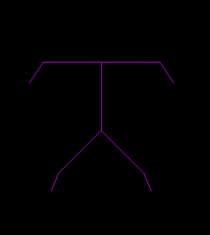
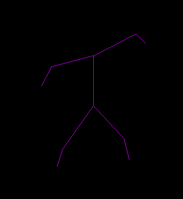

# dancing-man
Control joint positions to make the man dance.

$ virutalenv env

$ source env/bin/activate

$ pip install -r requirements.txt

$ sudo python figure.py

Press 'h' or 'f' to move hands and feet respectively.

